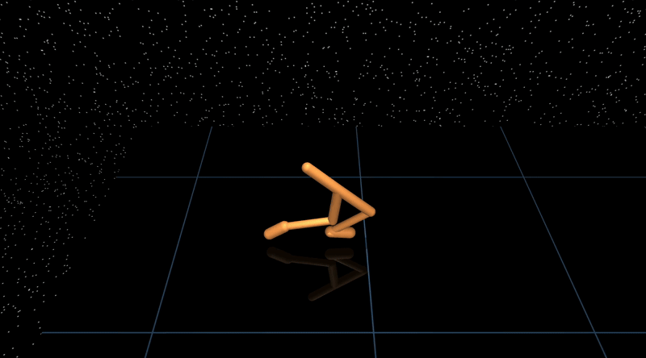

# Random Search
A simple [C++](https://en.wikipedia.org/wiki/C%2B%2B) implementation of [random search](https://arxiv.org/abs/1803.07055) for [locomotion tasks](https://github.com/openai/gym/tree/master/gym/envs/mujoco) using [MuJoCo](https://mujoco.org/).


## Installation
`rs.cpp` should work with Ubuntu and macOS.

### Prerequisites
Operating system specific dependencies:

#### macOS
Install [Xcode](https://developer.apple.com/xcode/).

Install `ninja`:
```sh
brew install ninja
```

#### Ubuntu
```sh
sudo apt-get update && sudo apt-get install cmake libgl1-mesa-dev libxinerama-dev libxcursor-dev libxrandr-dev libxi-dev ninja-build clang-12
```

### Clone rs.cpp
```sh
git clone https://github.com/thowell/rs.cpp
```

### Build and Run
1. Change directory:
```sh
cd rs.cpp
```

2. Create and change to build directory:
```sh
mkdir build
cd build
```

3. Configure:

#### macOS
```sh
cmake .. -DCMAKE_BUILD_TYPE:STRING=Release -G Ninja
```

#### Ubuntu
```sh
cmake .. -DCMAKE_BUILD_TYPE:STRING=Release -G Ninja -DCMAKE_C_COMPILER:STRING=clang-12 -DCMAKE_CXX_COMPILER:STRING=clang++-12
```

4. Build
```sh
cmake --build . --config=Release
```

### Build and Run rs.cpp using VSCode
[VSCode](https://code.visualstudio.com/) and 2 of its
extensions ([CMake Tools](https://marketplace.visualstudio.com/items?itemName=ms-vscode.cmake-tools)
and [C/C++](https://marketplace.visualstudio.com/items?itemName=ms-vscode.cpptools))
can simplify the build process.

1. Open the cloned directory `rs.cpp`.
2. Configure the project with CMake (a pop-up should appear in VSCode)
3. Set compiler to `clang-12`.
4. Build and run the `rs` target in "release" mode (VSCode defaults to
   "debug").

## Train cheetah
Train cheetah in ~10 seconds using 20 threads with [Intel Core i9-14900K](https://www.intel.com/content/www/us/en/products/sku/236773/intel-core-i9-processor-14900k-36m-cache-up-to-6-00-ghz/specifications.html) CPU and [Ubuntu 22.04.4 LTS](https://releases.ubuntu.com/jammy/) (~20 seconds using 10 threads on Apple M1 Pro).


From the `build/` directory, run:
```sh
./rs --env cheetah --search --visualize --checkpoint cheetah
```

The saved policy can be visualized:
```
./rs --env cheetah --load cheetah --visualize
```


## Environments
Environments available:

- [Ant](rs/envs/ant.py)
  - based on [ant_v5](https://github.com/Farama-Foundation/Gymnasium/blob/main/gymnasium/envs/mujoco/ant_v5.py)
  - modified solver settings
  - only contact between feet and floor
  - no rewards or observations dependent on contact forces
- [Cheetah](rs/envs/cheetah.py)
  - based on [half_cheetah_v5](https://github.com/Farama-Foundation/Gymnasium/blob/main/gymnasium/envs/mujoco/half_cheetah_v5.py)
  - modified solver settings
- [Humanoid](rs/envs/humanoid.py)
  - based on [humanoid_v5](https://github.com/Farama-Foundation/Gymnasium/blob/main/gymnasium/envs/mujoco/humanoid_v5.py)
  - modified solver settings
  - only contact between feet and floor
  - no rewards or observations dependent on contact forces
- [Walker](rs/envs/walker.py)
  - based on [walker2d_v5](https://github.com/Farama-Foundation/Gymnasium/blob/main/gymnasium/envs/mujoco/walker2d_v5.py)
  - modified solver settings
  - only contact between feet and floor


## Usage
**Note**: run multiple times to find good policies.

Run from `build/`:

### Ant


Search:
```sh
./rs --env ant --search
```

Visualize policy checkpoint:
```sh
./rs --env ant --load pretrained/ant_2063_239 --visualize
```

### Cheetah


Search:
```sh
./rs --env cheetah --search
```

Visualize policy checkpoint:
```sh
./rs --env cheetah --load pretrained/cheetah_3750_239 --visualize
```

### Humanoid


Search:
```sh
./rs --env humanoid --search
```

Visualize policy checkpoint:
```sh
./rs --env humanoid --load pretrained/humanoid_2291_1931 --visualize
```

### Walker


Search:
```sh
./rs --env walker --search
```

Visualize policy checkpoint:
```sh
./rs --env walker --load pretrained/walker_5619_41 --visualize
```


## Notes
- This implementation is **not** deterministic. You may need to run the search multiple times to find a good policy.
- The environments are based on the [v5 MuJoCo Gym environments](https://github.com/Farama-Foundation/Gymnasium/tree/main/gymnasium/envs/mujoco) but may not be exact in all details.
- The search settings are based on [Simple random search provides a competitive approach to reinforcement learning: Table 9](https://arxiv.org/abs/1803.07055) but may not be exact in all details either.